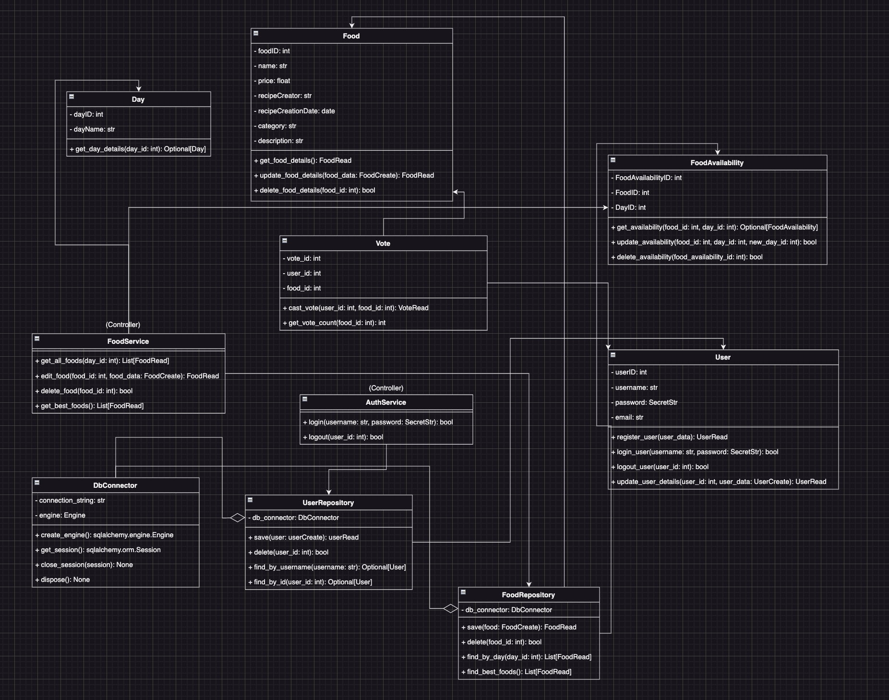
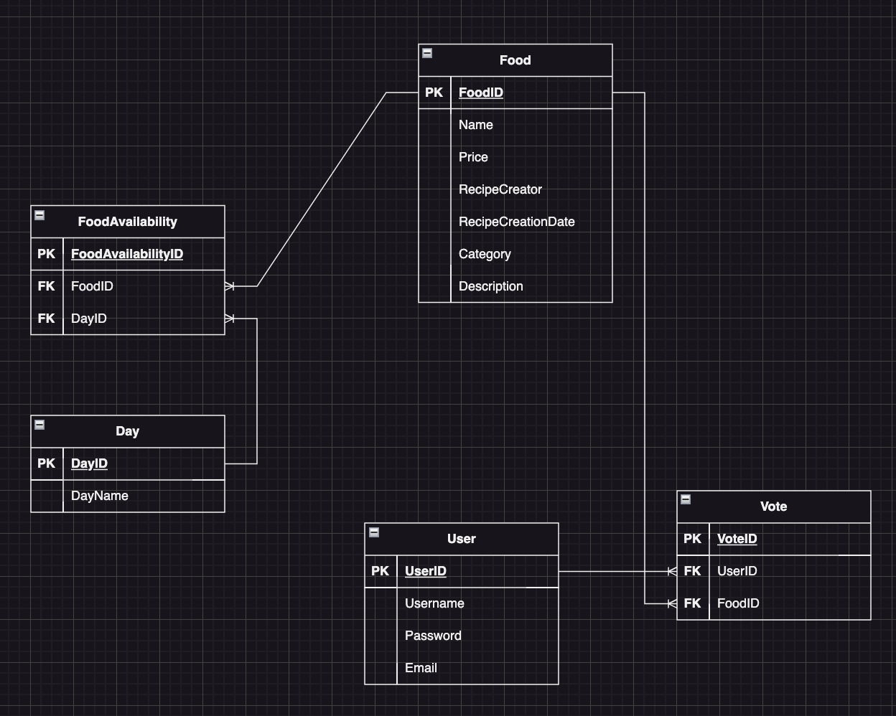

# 🍽️ Hamburgery

Welcome to the **Hamburgery**! This project is a web application designed to manage the daily menu of the Hada mifkada. The backend is powered by **FastAPI** for the API, **Sqlalchemy** for the ORM with **Pydantic** for data validation, and includes features such as user authentication, menu management, and food rating.

## 📐 Diagrams

### UML Diagram



### ERD Diagram




## 🚀 Features

- **Food Management**: Add, edit, delete, and view foods available in the Hada, complete with details like name, price, recipe creator, description, and availability.
- **Day-wise Menu Display**: See which foods are available on which day, allowing for easy planning and viewing.
- **User Authentication**: Secure login and registration system for managing user access.
- **Voting System**: Users can vote for their favorite foods, with results displayed in a table of the best-rated dishes.
- **FastAPI & SQLAlchemy**: Modern Python web framework and ORM for efficient and scalable backend development.

## 🛠️ Tech Stack

- **Backend**: [FastAPI](https://fastapi.tiangolo.com/)
- **ORM**: [SQLAlchemy](https://www.sqlalchemy.org/)
- **Data Validation**: [Pydantic](https://pydantic-docs.helpmanual.io/)
- **Database**: [Postgresql](https://www.postgresql.org/)

## 🛠️ Installation

1. **Clone the repository:**

   ```bash
   git clone https://github.com/Omer8990/Hamburgery.git
   cd hamburgery
   ```

2. **Create a virtual environment and activate it:**

   ```bash
   python3 -m venv env
   source env/bin/activate  # On Windows use `env\Scripts\activate`
   ```

3. **Install dependencies:**

   ```bash
   pip install -r requirements.txt
   ```

4. **Set up environment variables:**

   Create a `.env` file in the root directory and configure it according to your needs. Example:

   ```ini
   DATABASE_URL=sqlite:///./hamburgery.db
   SECRET_KEY=your-secret-key
   ALGORITHM=HS256
   ACCESS_TOKEN_EXPIRE_MINUTES=30
   ```

5. **Apply database migrations:**

   ```bash
   alembic upgrade head
   ```

6. **Run the application:**

   ```bash
   uvicorn app.main:app --reload
   ```

7. **Access the API:**

   - Go to `http://127.0.0.1:8000/docs` to explore the interactive API documentation provided by **Swagger UI**.

## 🎯 Usage

- **Food Management**:
  - View all foods: `GET /api/v1/foods/`
  - Add a new food: `POST /api/v1/foods/`
  - Update a food: `PUT /api/v1/foods/{food_id}`
  - Delete a food: `DELETE /api/v1/foods/{food_id}`

- **User Management**:
  - Register: `POST /api/v1/users/`
  - Login: `POST /api/v1/auth/login`

- **Voting**:
  - Cast a vote: `POST /api/v1/votes/`

## 🧪 Testing

To run the tests, ensure that you have `pytest` installed, then run:

```bash
pytest
```


## 📧 Contact

For any inquiries, feel free to reach out:

- **Email**: [your-email@example.com](mailto:omer.haimovitz@gmail.com)
- **LinkedIn**: [Your LinkedIn Profile](https://www.linkedin.com/in/omer-h-1531a5225?trk=contact-info)
